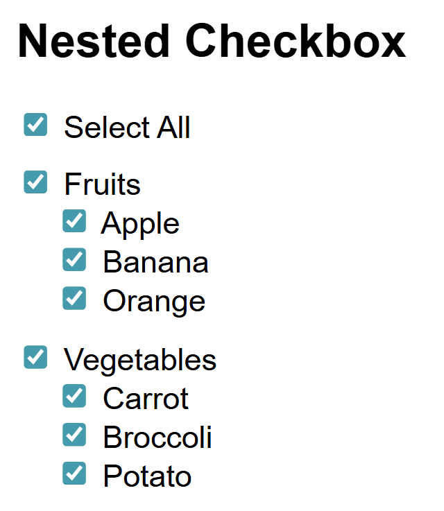
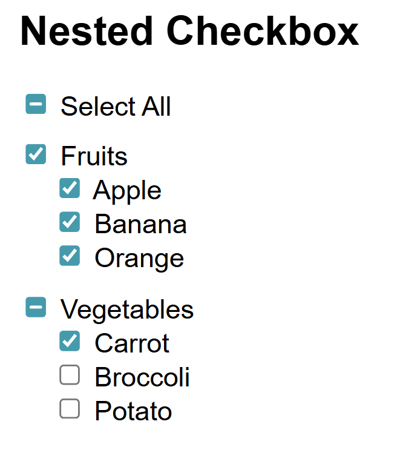
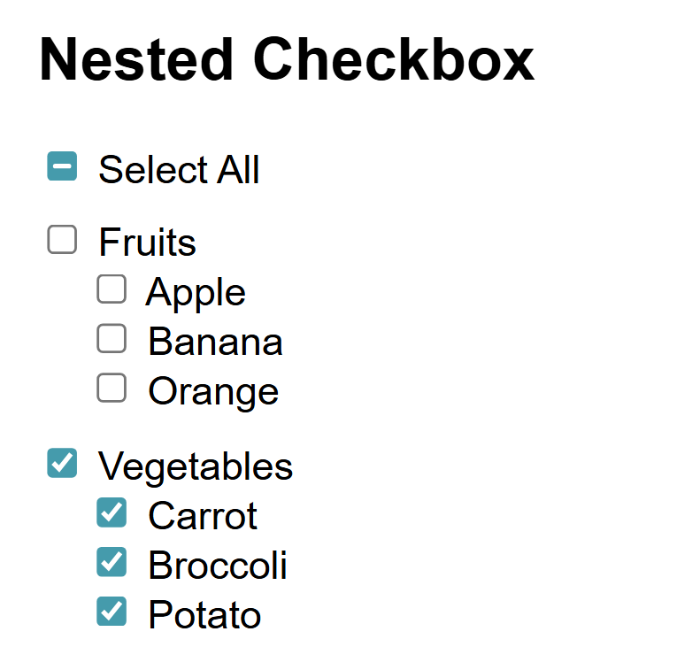

# Nested Checkbox with Indeterminate State

This project demonstrates a **nested checkbox system** with support for the `indeterminate` state.  
It includes a **"Select All"** checkbox, category checkboxes (e.g., Fruits, Vegetables), and individual item checkboxes.

The logic ensures proper synchronization between all levels:

- Checking/unchecking "Select All" toggles all categories and items.
- Checking/unchecking a category toggles its items.
- Checking/unchecking items updates their parent category.
- The `indeterminate` state is applied when only some children are selected.

---

## Features

- **Select All Control**  
  One checkbox to control all categories and items.

- **Category Control**  
  Each category can toggle all its items.

- **Indeterminate State**  
  Categories and the "Select All" checkbox reflect partial selections using the `indeterminate` property.

- **Dynamic Synchronization**  
  State updates are automatic when any checkbox changes.

---

## Tech Stack

- **HTML5** – Structure of the checkboxes.
- **CSS3** – Basic styling.
- **Vanilla JavaScript (ES6)** – Checkbox state management and event handling.

---

## File Structure

nested-checkbox/
│── index.html # Main file containing HTML, CSS, and JavaScript

---

## How to Run

1. Clone or download this repository.
2. Open `index.html` in your browser.
3. Interact with the checkboxes to test functionality.

---

## Example

- Selecting "Select All" → All categories and items checked.
- Deselecting one item → Parent category becomes `indeterminate`.
- Deselecting all items in a category → Parent category unchecked.
- Mixed selections across categories → "Select All" becomes `indeterminate`.

---

## Screenshot (Optional)

---

## Future Improvements

- Add more categories dynamically with JavaScript.
- Store checkbox states in localStorage.
- Improve UI styling (e.g., with Tailwind or Bootstrap).

---

## License

This project is open-source and free to use.
